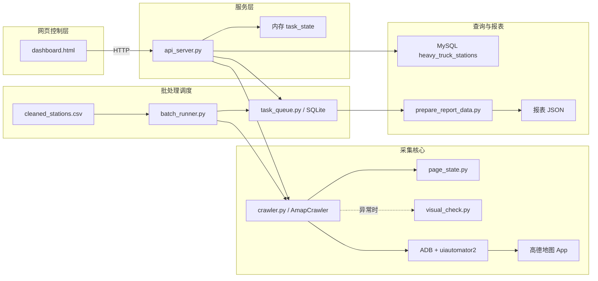
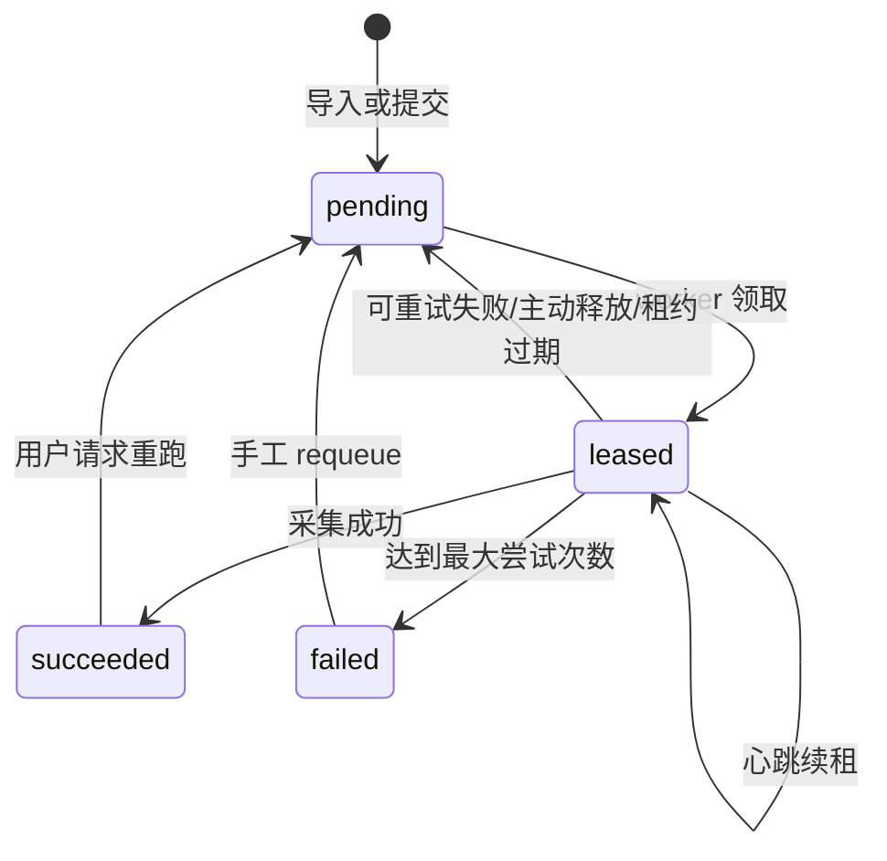
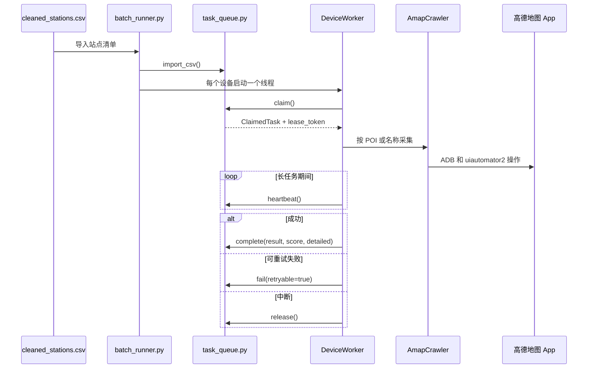
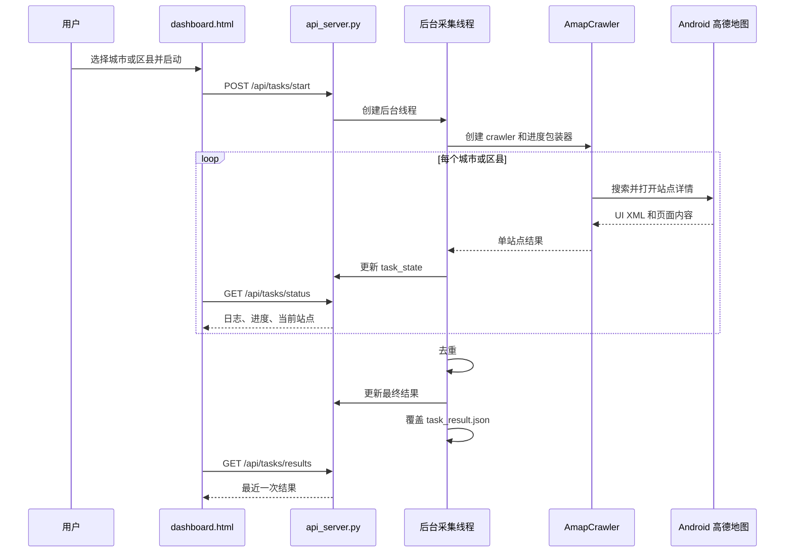

# 高德地图重卡充电站采集系统代码说明与审查指南

> 面向后续开发、维护、排障和重构的系统级代码说明。

| 项目 | 内容 |
|---|---|
| 文档版本 | 1.1 |
| 更新时间 | 2026-08-12 |
| 审查基线 | `master` 分支，提交 `cbdc7ad` 加当前分时电价改动 |
| 适用范围 | 当前工作区内的 Python、HTML、批处理、测试、配置和数据准备代码 |
| 当前验证基线 | `55 passed, 2 subtests passed`，另有 FastAPI 生命周期弃用警告 |
| 文档性质 | 代码结构说明、模块联动说明、风险审查和改进路线 |

## 1. 文档目的

本项目不是单一采集脚本，而是由手机自动化采集、页面状态识别、视觉兜底、网页控制台、SQLite 多设备调度、MySQL 查询服务和报表数据准备等部分共同组成。

本文档用于：

1. 解释工作区中每个代码文件的用途。
2. 说明模块之间如何调用、共享数据和互相影响。
3. 说明当前系统已经完成的能力和实际边界。
4. 标出重复代码、潜在错误、安全风险和技术债。
5. 给出后续改进顺序，避免重构时破坏已有流程。

本文档以当前代码实际行为为准；当 README、注释与实现不一致时，会单独说明。

## 2. 系统是什么

这是一个通过 ADB 和 `uiautomator2` 控制 Android 手机上的高德地图 App，搜索并采集重卡充电站详情的工具系统。

系统目前有三种主要用途：

- **人工控制的单机普查**：在网页 Dashboard 选择城市或区县，后台控制一台手机进行搜索和详情采集。
- **可恢复的多设备批处理**：把站点清单导入 SQLite 队列，由多个 Android 设备并行领取、执行、重试和回写任务。
- **面向业务方的数据查询**：把结果导入 MySQL 后，通过 FastAPI 提供列表、详情、附近站点和统计接口。

此外，系统能把 SQLite 中的任务结果和尝试记录展开成报表用 JSON，但目前不直接生成 Excel 文件。

## 3. 当前已完成能力

### 3.1 采集与稳定性

- 支持河南 18 个城市的区县级搜索配置，当前代码中共有 157 个区县项。
- 能识别搜索结果页并增量扫描可见站点卡片。
- 发现站点后会立即尝试进入详情，不必先滚动完整个列表。
- 优先通过高德 POI ID 打开详情，失败后再回退到可见卡片点击和名称搜索。
- 支持多类详情页以及名称、地址、运营商、状态、电价、设备、停车费、设施等字段。
- 含趋势图和无趋势图的站点都会优先尝试进入价格详情页，采集参考价、电费和服务费；内嵌趋势用于点击失败或缺失时段兜底。
- 点击价格入口后会确认进入价格详情页，返回后会确认仍是原站点详情，避免误点无关“查看详情”后继续滚动。
- 可通过高德 Web 服务补充经纬度，并按名称和坐标距离去重。
- 停止事件已贯穿等待、搜索、滚动和详情采集路径。
- 页面判断集中在 `page_state.py`，可避免搜索结果页被误认为详情页。
- 进度包装器只安装一次，已避免循环中重复包装造成递归调用。
- 数值站点路由使用 `{station_id:int}`，不再与 `/api/stations/nearby` 冲突。
- 区县任务支持按地址过滤越界结果。

### 3.2 调度与服务

- SQLite 队列支持唯一任务、高优先级用户任务、租约、心跳、过期恢复和失败重试。
- 支持多设备 worker 并行领取任务，并对结果计算完整度和详细标记。
- 失败时可保存 XML、截图和 JSON 现场。
- FastAPI 可在 MySQL 未配置时以离线模式启动。
- Windows 脚本可启动服务、检查健康状态、打开 Dashboard，并通过 PID 精确停止后端。
- 页面状态、视觉兜底、核心回归、任务队列和报表处理测试已覆盖当前关键修复。

## 4. 总体架构



### 4.1 必须理解的数据边界

当前系统存在三套互不自动同步的结果状态：

| 执行链 | 结果保存位置 | 是否自动进入其他存储 |
|---|---|---|
| Dashboard 单机普查 | 内存 `task_state` 和根目录 `task_result.json` | 否 |
| 多设备批处理 | `data/station_tasks.db` | 否 |
| 查询 API | MySQL `heavy_truck_stations` | 否 |

因此，“手机已经采集成功”不等于“查询 API 已经能查到”。要让查询 API 可见，仍需执行明确的 MySQL 导入流程。

## 5. 三种运行模式

| 模式 | 入口 | 适合场景 | 状态持久化 | 主要限制 |
|---|---|---|---|---|
| 网页单机普查 | `start.bat` → `/dashboard` | 人工选择城市、区县并观察日志 | 结果 JSON，过程主要在内存 | 不支持任务历史和断点恢复 |
| SQLite 多设备批处理 | `python batch_runner.py run` | 大批量站点、并发设备、自动重试 | SQLite | 需要独立查看或导出结果 |
| MySQL 查询服务 | `python api_server.py` | 给其他系统提供查询接口 | MySQL | 不会自动接收前两条链的结果 |

## 6. 工作区文件总览

### 6.1 正式源代码和配置

| 文件 | 主要职责 | 直接关联 |
|---|---|---|
| `.env.example` | 环境变量模板，不包含真实密钥 | `crawler.py`、`api_server.py`、`visual_check.py` |
| `.gitignore` | 排除密钥、日志、数据库、截图和生成结果 | 整个仓库 |
| `README.md` | 快速启动和功能概览 | 面向使用者，但部分描述与实现不一致 |
| `CHANGELOG.md` | 记录本轮功能修复和验证结果 | 面向交付和版本追踪 |
| `crawler.py` | 手机自动化采集核心 | 页面识别、视觉兜底、ADB、高德 API |
| `page_state.py` | 根据 UI XML 判断当前页面类型 | 被采集器和测试调用 |
| `visual_check.py` | 截图、视觉模型判断和页面恢复 | 被单机采集链可选使用 |
| `api_server.py` | FastAPI、MySQL API、SQLite 队列 API、单机任务 API | 连接多数核心模块 |
| `dashboard.html` | 单机普查网页控制台 | 调用 `/api/tasks/*` |
| `task_queue.py` | SQLite 持久化任务队列 | 被批处理、API 和报表工具调用 |
| `batch_runner.py` | 多设备 worker、任务领取、执行和回写 | `task_queue.py`、`crawler.py` |
| `prepare_report_data.py` | 将 SQLite 任务展开为报表 JSON | 队列数据、高德 POI API |
| `run_backend.py` | 后台启动 FastAPI，并写入 PID | `api_server.py`、PID 文件 |
| `stop_backend.py` | 读取 PID 并精确停止项目进程树 | `data/api_server.pid` |
| `start.bat` | 一键启动、健康检查、打开 Dashboard 和停止服务 | 两个后端管理脚本 |

### 6.2 输入、样例和旧版脚本

| 文件 | 作用 | 当前定位 |
|---|---|---|
| `cleaned_stations.csv` | 批处理站点输入表 | `batch_runner.py run` 的默认 CSV |
| `batch_test_v2.py` | 旧版真机端到端采集脚本 | 与核心采集器重复，建议转为 legacy 或 smoke test |
| `batch_test_result.json` | 旧版脚本的样例结果 | 人工参考，不是正式数据库 |
| `fix_stop.py` | 一次性停止接口补丁脚本 | 未被 Git 跟踪，修复已进入正式代码，建议删除 |

### 6.3 自动化测试

| 文件 | 覆盖内容 |
|---|---|
| `test_page_state.py` | 搜索页、详情页、价格详情页、弹窗等页面状态判定 |
| `test_visual_check.py` | 视觉模型适配、文本兜底和恢复逻辑 |
| `test_regressions.py` | 停止、路由、包装器、区县过滤、增量点击和分时电价等回归问题 |
| `test_task_queue.py` | 唯一性、优先级、租约、重试、恢复和设备选择 |
| `test_prepare_report_data.py` | 行政区解析、设备摘要和报表行构造 |

### 6.4 本地运行产物

| 路径 | 内容 |
|---|---|
| `data/` | SQLite 数据库、PID、队列快照、POI 缓存和报表 JSON |
| `logs/` | API 和批处理日志 |
| `debug_runs/` | 失败现场、增量扫描和点击问题复现材料 |
| `screenshots/` | 页面截图和 XML dump |
| `outputs/` | 其他生成输出 |
| `task_result.json` | Dashboard 最近一次单机任务结果，会被覆盖 |
| `debug_current.png` | 本地调试截图 |
| `.pytest_cache/`、`__pycache__/` | 测试和 Python 字节码缓存 |

## 7. 核心模块详细说明

### 7.1 `crawler.py`：采集核心

`crawler.py` 是整个项目最核心、最复杂的文件。其他运行模式最终都依赖 `AmapCrawler` 控制手机并解析页面。

#### 顶层函数

| 函数 | 功能 |
|---|---|
| `generate_search_queries()` | 根据城市与区县配置生成搜索词，但当前正式执行链没有调用 |
| `find_price_detail_entry()` | 从详情 XML 定位趋势图或价格卡片的真实可点击容器，并规避无关大容器 |
| `classify_detail_page()` | 根据详情 XML 特征识别详情页类型 |
| `parse_detail_xml()` | 从详情页 XML 提取名称、地址、价格和设备等字段 |
| `parse_price_detail_page()` | 解析价格详情页的时段、参考价、电费和服务费，并合并重复时段 |
| `merge_price_periods()` | 统一价格结构，详情页数据优先，内嵌趋势补齐缺失字段或时段 |
| `merge_results()` | 合并多次 XML dump 的字段，保留更完整的数据 |
| `geocode()` | 调用高德 Web 服务将地址转换为经纬度 |

#### `AmapCrawler` 的职责

| 方法 | 功能与联动 |
|---|---|
| `__init__()` | 连接指定 Android 设备，保存视觉检查器和停止事件 |
| `_should_stop()` | 统一判断是否收到停止信号 |
| `_ensure_amap_foreground()` | 保证高德 App 位于前台 |
| `_wait_for_page()` | 循环 dump XML，并调用 `page_state.assess_page()` 等待目标页 |
| `_confirm_detail_page()` | 二次确认详情页与目标站点是否匹配 |
| `_open_poi_detail()` | 优先根据 POI ID 精确打开站点详情 |
| `_recover_to_search_results()` | 从详情、弹窗或异常页返回搜索结果 |
| `_collect_price_detail()` | 点击电价入口、确认 `PRICE_DETAIL`、解析价格并校验返回原站点详情 |
| `_extract_visible_station_cards()` | 从当前 XML 提取可见卡片、名称、ID 和 bounds |
| `_scan_search_results_incrementally()` | 逐屏发现新卡片，并立即调用站点处理器 |
| `_enter_search_query()` | 定位搜索框、清空旧文本、输入查询词并提交 |
| `search_stations()` | 搜索入口；可返回列表，也可通过 `station_handler` 增量处理 |
| `_open_visible_station()` | 点击当前屏幕内的站点卡片 |
| `_find_and_click_station()` | 滚动查找目标名称并点击，属于回退方案 |
| `collect_detail()` | 打开并解析一个站点详情，必要时滚动和进入价格页 |
| `_collect_district_search()` | 执行一个区县搜索并过滤越界结果 |
| `run_district()` | 构造“城市+区县+重卡充电站”查询并采集 |
| `run_city()` | 遍历该城市配置的区县 |
| `run_all()` | 遍历多个城市并在结尾统一去重 |
| `deduplicate_results()` | 根据名称和坐标距离合并疑似重复站点 |
| `save_results()` | 将 `self.results` 保存为 JSON |

#### 单个站点的核心执行顺序

```text
搜索词提交
  → 识别搜索结果页
  → 提取当前屏幕可见卡片
  → 新发现站点立即交给 station_handler
  → 优先用 POI ID 打开详情
  → 失败则点击可见卡片或按名称查找
  → page_state 确认详情页
  → 初始 XML 解析与页面分类
  → 若存在价格入口，滚动前点击并确认进入 PRICE_DETAIL
  → 解析参考价、电费、服务费后返回并确认原站点详情
  → 按页面类型继续滚动采集其他字段
  → 合并多次解析结果
  → 价格详情优先，内嵌趋势补齐缺失字段或时段
  → 地址与目标区县校验
  → 加入 crawler.results
  → 返回搜索结果页继续扫描
```

#### 关键注意事项

- `run_city()` 当前只遍历区县，没有额外执行“全市兜底搜索”。
- `generate_search_queries()` 理论上可生成 175 条查询，但当前没有被运行入口使用。
- `full_trend` 仍保留两次滚动策略，但会先进入价格详情页；点击失败时不会丢弃站点页已有的趋势数据。
- `price_schedule_source="price_detail"` 表示本次获得了详情页价格；其中个别补齐时段仍可通过价格项的 `source="embedded_trend"` 识别。
- 去重依赖坐标；任意一条缺少坐标时，该对记录会跳过去重比较。
- 文件末尾直接运行会采集郑州，并将结果写入固定桌面绝对路径，不适合作为通用 CLI。

### 7.2 `page_state.py`：页面状态识别

该模块把 UI XML 的页面判定从采集器中独立出来，是防止误点击和误解析的关键层。

- `PageKind`：首页、搜索结果、详情、价格详情、弹窗和未知等页面类别。
- `PageAssessment`：页面类别、命中特征和目标站点匹配信息。
- `normalize_station_name()`：统一名称格式，降低符号或空格差异造成的匹配失败。
- `_extract_values()`：从 XML 提取可用于判断页面的文本、描述和资源值。
- `assess_page()`：组合特征并返回结构化页面判断。
- `is_detail_page()`、`is_search_results_page()`：兼容旧调用方的布尔入口。

价格详情页通常通过多个时间段和费用组成识别；若页面带“充电价格详情”等标题，单个时间段加参考价及电费或服务费也可识别为 `PRICE_DETAIL`。

`crawler.py` 的页面等待、详情确认、价格跳转和搜索结果恢复都依赖这里。修改判定规则时，应优先补充 `test_page_state.py` 和 `test_regressions.py`。

### 7.3 `visual_check.py`：视觉兜底

视觉模块用于 XML 信息不足、弹窗遮挡或页面状态异常时的辅助判断，不应替代确定性的 XML 解析。

| 类型或函数 | 职责 |
|---|---|
| `PageState` | 视觉层自己的页面状态枚举 |
| `VisualChecker` | 截图、文字兜底、视觉检查、关闭弹窗和恢复详情页 |
| `VisualModelAdapter` | 把自定义模型函数包装成统一调用格式 |
| `QianwenVisionAdapter` | 调用千问视觉模型并标准化结果 |
| `integrate_with_crawler()` | 将视觉检查器附加到现有 crawler |
| `create_qianwen_checker()` | 创建连接指定设备的千问检查器 |

目前 `visual_check.PageState` 与 `page_state.PageKind` 是两套相近但不相同的状态模型，调用方需要理解和转换两套枚举。

### 7.4 `api_server.py`：混合型服务入口

该文件同时承担四类职责：

1. FastAPI 应用、CORS 和服务启动。
2. MySQL 表初始化及查询、统计、导入 API。
3. SQLite 站点队列提交和状态查询 API。
4. Dashboard 单机普查的线程启动、停止、进度和结果 API。

主要全局状态包括：

| 名称 | 用途 |
|---|---|
| `DB_CONFIG` | MySQL 连接配置 |
| `QUEUE_DB_PATH` | SQLite 队列数据库路径 |
| `stop_event` | Dashboard 单机任务停止事件 |
| `task_state` | 当前单机任务的运行状态、日志、进度和结果 |

`_run_crawl_task()` 创建 `AmapCrawler`，然后给 `search_stations()` 和 `collect_detail()` 安装进度包装器。包装器只安装一次，再按城市或区县执行，修复了过去循环中重复包装形成递归的问题。结束时执行去重，并覆盖写入根目录 `task_result.json`。

### 7.5 `dashboard.html`：单机普查界面

Dashboard 是一个无前端框架的单文件页面，内含 HTML、CSS 和 JavaScript。

- 在前端维护城市和区县列表，默认选择郑州城市级任务。
- 调用 `POST /api/tasks/start` 启动任务。
- 每 2 秒轮询 `GET /api/tasks/status`。
- 调用 `POST /api/tasks/stop` 停止任务。
- 调用 `GET /api/tasks/results` 展示最近结果。

前端区县配置与 `crawler.py` 中的 `CITY_DISTRICTS` 重复维护，后续容易发生漂移。

### 7.6 `task_queue.py`：SQLite 任务队列

这是多设备批处理的状态核心。它使用 SQLite WAL 模式，并在领取、完成、失败等关键写操作中使用事务。

#### 任务状态机



#### 核心方法

| 方法 | 作用 |
|---|---|
| `init_schema()` | 创建三张表和索引 |
| `import_csv()` | 导入 CSV，并将重复源记录归并到唯一站点任务 |
| `enqueue_user_task()` | 插入或提升用户指定站点的优先级 |
| `claim()` | 原子领取最高优先级可执行任务并创建 attempt |
| `heartbeat()` | 验证租约 token 并续约 |
| `set_attempt_strategy()` | 记录本次使用 POI ID 或搜索等策略 |
| `complete()` | 保存结果、完整度和详细标记 |
| `fail()` | 记录错误并决定重试或最终失败 |
| `release()` | worker 中断时安全释放任务 |
| `register_device()`、`heartbeat_device()` | 维护设备状态 |
| `recover_orphaned_leases()` | 回收失联 worker 的过期任务 |
| `stats()` | 汇总任务、尝试和设备状态 |
| `iter_task_rows()` | 为快照和报表输出完整任务数据 |

### 7.7 `batch_runner.py`：多设备执行器

该模块负责把 SQLite 中的抽象任务变成真实设备操作。

- `discover_devices()`：调用 ADB 发现可用设备。
- `WorkBudget`：限制本次最多处理多少个任务。
- `LeaseHeartbeat`：后台续租，防止长时间采集被误判为失联。
- `evaluate_detail()`：给采集结果计算完整度分数和详细标记。
- `DeviceWorker`：每台设备对应一个线程，循环领取和执行任务。
- `save_failure_artifacts()`：保存失败 XML、截图和错误 JSON。
- `write_snapshot()`：将当前队列导出为 JSON 快照。

#### CLI 子命令

| 命令 | 用途 |
|---|---|
| `python batch_runner.py run` | 可导入 CSV，并启动一个或多个设备 worker |
| `python batch_runner.py status` | 查看队列统计，可选导出快照 |
| `python batch_runner.py enqueue` | 提交高优先级单站点任务 |

#### 多设备执行时序



### 7.8 `prepare_report_data.py`：报表数据准备

该脚本读取 SQLite，而不是读取 MySQL 或 `task_result.json`。它会：

1. 读取所有唯一任务。
2. 展开 `source_records`，恢复 CSV 中的原始重复行。
3. 从采集结果、输入地址和名称推断城市与区县。
4. 缺少行政区或地址时，可调用高德 POI API 补元数据。
5. 汇总设备信息、价格时段、覆盖状态和城市完成率。
6. 附加 `task_attempts` 尝试历史。
7. 输出结构化 JSON。

它的名称容易让人误以为会直接生成 Excel；当前实际边界是“准备 Excel 报表所需的 JSON 数据”。

### 7.9 Windows 启停脚本

```text
双击 start.bat
  → 检查 Python
  → 检查 127.0.0.1:8800 是否已运行
  → run_backend.py 后台启动 api_server.py
  → 写 data/api_server.pid
  → 最多等待 30 秒健康检查
  → 打开 /dashboard
  → 用户按键后 stop_backend.py 按 PID 停止进程树
```

该链路已经替代直接执行 `taskkill /IM python.exe` 的危险方式。

## 8. 模块依赖关系

| 调用方 | 被调用方 | 调用目的 |
|---|---|---|
| `dashboard.html` | `api_server.py` | 启动、停止、轮询和展示单机任务 |
| `api_server.py` | `crawler.py` | 执行城市或区县采集 |
| `api_server.py` | `visual_check.py` | 可选创建千问视觉检查器 |
| `api_server.py` | `task_queue.py` | 提交和查询 SQLite 站点任务 |
| `api_server.py` | MySQL | 查询、统计和批量导入 |
| `batch_runner.py` | `task_queue.py` | 领取、续租、完成、失败和设备心跳 |
| `batch_runner.py` | `crawler.py` | 在每台设备上执行真实采集 |
| `crawler.py` | `page_state.py` | 识别搜索结果、详情、价格和异常页面 |
| `crawler.py` | `visual_check.py` | XML 无法确认时做视觉兜底 |
| `crawler.py` | 高德 Web API | 地址地理编码 |
| `prepare_report_data.py` | `task_queue.py` | 读取任务和结果 |
| `prepare_report_data.py` | 高德 POI API | 补充行政区和地址元数据 |
| `start.bat` | `run_backend.py` | 后台启动服务 |
| `stop_backend.py` | Windows `taskkill` | 按 PID 停止本项目进程树 |

## 9. 主要数据流

### 9.1 Dashboard 单机普查



### 9.2 MySQL 查询链

```text
外部调用方
  → POST /api/stations/batch
  → api_server.py 将列表逐条 INSERT
  → MySQL heavy_truck_stations
  → GET /api/stations、/{id}、/nearby、/stats 查询
```

### 9.3 报表链

```text
data/station_tasks.db
  → prepare_report_data.py
  → 展开 source_records
  → 关联结果和 task_attempts
  → 可选 POI 元数据补充
  → data/report_data.json
  → 外部 Excel 生成流程
```

### 9.4 数据之间不会自动流转

| 来源 | 想进入的目标 | 当前是否自动完成 | 所需动作 |
|---|---|---|---|
| Dashboard 结果 | SQLite 队列 | 否 | 需要编写导入或统一任务服务 |
| Dashboard 结果 | MySQL | 否 | 调用批量导入 API 或新增同步作业 |
| SQLite 成功任务 | MySQL | 否 | 从队列导出并进行幂等导入 |
| MySQL 数据 | 报表 JSON | 否 | 当前报表脚本只读取 SQLite |

## 10. 核心数据结构

### 10.1 采集结果字典

采集结果不是固定 Pydantic 模型，而是 Python 字典。不同详情页提供的字段不同，调用方必须允许字段缺失或为空。

| 字段组 | 主要字段 |
|---|---|
| 标识 | `station_name`、POI `id`、`search_city`、`search_district` |
| 状态 | `business_status`、`business_hours`、`collected_at` |
| 位置 | `address`、`longitude`、`latitude` |
| 运营 | `operator`、`favorite_count`、`tags`、`facilities` |
| 价格 | `current_price`、`fast_prices`、`slow_prices`、`price_schedule_source`、`price_detail_attempted`、`price_detail_collected`、`parking_fee`、`occupancy_fee` |
| 快充 | `fast_available`、`fast_total`、`fast_power` |
| 超充 | `super_available`、`super_total`、`super_power` |
| 慢充 | `slow_available`、`slow_total`、`slow_power` |

`fast_prices` 和 `slow_prices` 中每个分时价格使用统一结构：

| 字段 | 含义 |
|---|---|
| `time` | 时段，统一为 `HH:MM-HH:MM` |
| `total_price` | 参考总价；兼容读取旧输入字段 `price`，输出不再使用 `price` |
| `elec_fee` | 电费组成，内嵌趋势未提供时为空字符串 |
| `service_fee` | 服务费组成，内嵌趋势未提供时为空字符串 |
| `tag` | `最低`、`当前计费时段` 等页面标签 |
| `source` | `price_detail` 或 `embedded_trend`，表示该时段最终数据来源 |

站点级 `price_schedule_source` 表示整体优先来源；`price_detail_attempted` 表示是否发现并点击了入口，`price_detail_collected` 表示价格详情页是否成功解析出至少一个时段。

### 10.2 SQLite 表

#### `station_tasks`

保存唯一站点任务、原始 payload、优先级、状态、尝试次数、租约、最终结果和完整度。

- `station_id`：唯一任务标识。
- `payload_json`：输入数据以及可能合并的 `source_records`。
- `status`：`pending`、`leased`、`succeeded`、`failed`。
- `lease_owner`、`lease_token`、`lease_expires_at`：并发安全和任务回收。
- `rerun_requested`：执行中再次提交时，在安全完成后安排重跑。
- `result_json`：最终采集结果。
- `completeness_score`、`detailed`：结果质量标记。

#### `task_attempts`

每次真实执行一条记录，包含设备、策略、结果、错误、开始和结束时间，用于诊断失败与重试。

#### `device_workers`

保存设备序列号、worker ID、状态、当前任务、元数据和最后心跳。

### 10.3 MySQL 表 `heavy_truck_stations`

该表用于查询服务，字段与采集结果大体对应，并对城市、运营商和经纬度建立普通索引。

当前表没有保存来源 POI ID，也没有约束业务唯一性的唯一键。因此同一批数据重复导入会产生重复记录。

### 10.4 Dashboard 内存状态 `task_state`

| 字段 | 含义 |
|---|---|
| `running` | 是否正在执行 |
| `current_city` | 当前城市或区县提示 |
| `current_station` | 当前搜索词或站点 |
| `progress` | 当前只有 `done` 和 `total` |
| `log` | 最近任务日志，数量过多时会截断 |
| `results` | 本次去重后的结果 |
| `started_at` | 启动时间 |
| `error` | 最近错误 |

这是进程内全局变量，服务重启后会丢失，也没有任务 ID 或历史任务隔离。

## 11. API 接口说明

### 11.1 基础与 Dashboard

| 方法 | 路径 | 功能 |
|---|---|---|
| GET | `/` | 返回服务信息和主要端点列表 |
| GET | `/dashboard` | 返回 `dashboard.html` |
| GET | `/docs` | FastAPI 自动生成的 Swagger 文档 |

### 11.2 MySQL 数据接口

| 方法 | 路径 | 主要参数 | 数据源 |
|---|---|---|---|
| GET | `/api/stations` | `city`、`operator`、`page`、`page_size` | MySQL |
| GET | `/api/stations/{station_id}` | 数值站点 ID | MySQL |
| GET | `/api/stations/nearby` | `lng`、`lat`、`radius`、`limit` | MySQL |
| GET | `/api/stats` | 无 | MySQL |
| POST | `/api/stations/batch` | 站点字典数组 | MySQL |

MySQL 不可用时，多数查询接口返回空结果并附带 `offline: true`，而不是让整个服务无法启动。

### 11.3 SQLite 队列接口

| 方法 | 路径 | 功能 |
|---|---|---|
| POST | `/api/queue/stations` | 提交用户高优先级站点任务 |
| GET | `/api/queue/status` | 查看队列、尝试和设备统计 |
| GET | `/api/queue/stations/{station_id}` | 查看指定站点任务详情 |

用户任务请求字段包括 `id`、`name`、`address`、`latitude`、`longitude`、`priority` 和 `max_attempts`。

### 11.4 Dashboard 单机任务接口

| 方法 | 路径 | 功能 |
|---|---|---|
| POST | `/api/tasks/start` | 按 `cities`、`districts`、`use_visual` 启动后台采集 |
| POST | `/api/tasks/stop` | 设置停止事件，并尝试返回高德首页 |
| GET | `/api/tasks/status` | 返回当前内存任务状态 |
| GET | `/api/tasks/results` | 返回当前或最近一次内存结果 |

## 12. 配置与环境变量

| 变量 | 使用位置 | 作用 | 当前默认行为 |
|---|---|---|---|
| `DEVICE_SERIAL` | `crawler.py` | Android 设备序列号 | 存在开发机默认值 |
| `ADB_PATH` | 采集器和批处理 | ADB 可执行文件路径 | 存在开发机绝对路径默认值 |
| `AMAP_API_KEY` | 采集器和报表元数据 | 高德 Web 服务 Key | 空值时无法调用相关 API |
| `DASHSCOPE_API_KEY` | `visual_check.py` | 千问视觉模型 Key | 未配置时不能使用在线视觉模型 |
| `DB_HOST`、`DB_PORT` | `api_server.py` | MySQL 地址和端口 | 主机空时进入离线模式，端口默认 3306 |
| `DB_USER`、`DB_PASSWORD` | `api_server.py` | MySQL 认证 | 默认空 |
| `DB_NAME` | `api_server.py` | MySQL 数据库名 | 默认空 |
| `DB_CHARSET` | `api_server.py` | MySQL 字符集 | `utf8mb4` |
| `DB_CONNECT_TIMEOUT` | `api_server.py` | 数据库连接超时 | 5 秒 |
| `STATION_TASK_DB` | `api_server.py` | SQLite 队列路径 | `data/station_tasks.db` |

真实密钥应放在本地环境或安全的 `.env` 管理体系中，不能写入仓库。

## 13. 测试体系

### 13.1 当前测试覆盖

- 页面状态识别。
- 停止事件是否传递到阻塞路径。
- 搜索后是否先处理新发现卡片再继续滚动。
- 趋势图和价格卡片是否进入价格详情页，而不是直接开始详情页滚动。
- 电价入口是否会误选停车费或其他模块中的“查看详情”。
- 点击后是否确认 `PRICE_DETAIL`，返回后是否确认仍是原站点详情。
- 分时价格是否保持统一字段、详情优先和趋势兜底语义。
- API 动态路由与固定路由冲突。
- 进度包装器是否重复递归包装。
- 区县地址匹配与越界过滤。
- 视觉检查器的文本回退与模型适配。
- SQLite 任务领取、心跳、重试、回收和用户优先级。
- 报表行政区解析和摘要字段。

### 13.2 建议验证命令

```powershell
python -m compileall -q .
python -m pytest -q
```

真机采集问题不能只依赖单元测试。修改点击、滚动、页面识别或恢复逻辑后，还应使用一台测试设备执行小范围 smoke test，并保留失败 XML 和截图。

## 14. 已确认的问题、冗余和技术债

以下项目按优先级排序。P0/P1 应优先处理，P2/P3 可随重构逐步解决。

### 14.1 P0/P1：优先修复

#### 1. Dashboard 进度口径不一致

**现状**：`done` 在每次调用 `collect_detail()` 前加一，实际表示尝试次数；任务完成后，`total` 被设置为去重后的成功结果数。

**影响**：可能出现 `7/2` 之类不合理进度，前端只能用估算公式掩盖。

**建议**：拆分为 `discovered`、`attempted`、`succeeded`、`skipped`、`failed`，不要用同一对 `done/total` 同时表达尝试和最终结果。

#### 2. 停止接口仍硬编码设备和 ADB 路径

**现状**：`api_server.py` 的停止处理使用固定设备序列号和开发机绝对 ADB 路径。

**影响**：换设备、换电脑或多设备运行时可能无法返回首页，且与 `DEVICE_SERIAL`、`ADB_PATH` 配置不一致。

**建议**：统一读取配置，并由任务管理器记录当前活跃设备集合。

#### 3. 三套数据状态没有自动同步

**现状**：Dashboard、SQLite 和 MySQL 分别保存数据。

**影响**：用户容易把“采集完成”和“查询接口已更新”理解为同一件事。

**建议**：确定单一事实源，或增加明确的同步任务、导入状态和失败重放机制。

#### 4. API 无认证且默认开放范围过大

**现状**：服务绑定 `0.0.0.0`，CORS 允许 `*`，启动、停止、批量导入和队列提交都没有认证。

**影响**：同一局域网中的其他设备可能控制采集或写入数据。

**建议**：默认监听 `127.0.0.1`；如需远程使用，增加令牌认证、最小 CORS 白名单和权限分级。

#### 5. Dashboard 结果表存在潜在 XSS

**现状**：采集到的站点名称、运营商等数据通过模板字符串写入 `innerHTML`，没有 HTML 转义。

**影响**：当页面开放给非完全可信数据源或局域网用户时，恶意文本可能被浏览器解析。

**建议**：使用 `textContent` 和 DOM 节点构造表格，或统一 HTML escape。

### 14.2 P1/P2：数据与架构问题

#### 6. MySQL 批量导入不幂等

MySQL 表没有 POI ID 或业务唯一键，`POST /api/stations/batch` 重复调用会重复插入。建议增加 `source_station_id` 唯一键并使用 upsert。

#### 7. 附近搜索扩展性较差

当前接口先查询全部有坐标的站点，再在 Python 中计算 Haversine 距离。数据量增加后，应改为空间索引、经纬度边界框或 SQL 距离计算。

#### 8. 阻塞数据库调用运行在 async 路由中

`pymysql` 是同步驱动，直接在 `async def` 路由中调用会阻塞事件循环。可将路由改为同步函数、放入线程池，或换成异步数据库驱动。

#### 9. 全局任务状态缺少统一锁和任务对象

`task_state` 由 API 线程和后台线程共同读写，目前没有完整锁保护，也没有保存线程引用和任务 ID。建议封装线程安全的 `TaskManager`。

#### 10. 城市和区县配置重复维护

`crawler.py::CITY_DISTRICTS` 与 `dashboard.html::CITIES` 是两份配置。建议增加 `/api/config/regions`，由后端提供唯一配置源。

#### 11. README 与实际行为不一致

- README 写“180+ 区县”，实际是 157 个区县配置项。
- 18 城加每城一次兜底理论上为 175 条查询，但 `generate_search_queries()` 没有被调用。
- README 和注释提到“全市兜底”，实际 `run_city()` 仅遍历区县。

建议修正文档，或把全市兜底恢复到正式执行链并增加测试。

#### 12. Dashboard 结果保存策略脆弱

每次任务都覆盖 `task_result.json`，没有任务 ID、历史结果和原子写入。建议保存到数据库或按任务 ID 命名，并通过临时文件加原子替换避免半写入。

#### 13. 坐标缺失记录无法参与去重

当前去重在任意一条记录缺少经纬度时直接跳过比较。同名但地理编码失败的站点可能重复保留。建议优先按 POI ID，其次按标准化名称、地址和坐标组合去重。

### 14.3 P2/P3：冗余与维护性

#### 14. 未使用定义

目前可见的未接入定义包括：

- `api_server.py::ChargingStation`
- `api_server.py::StationResponse`
- `api_server.py::safe_db_query`
- `crawler.py::generate_search_queries`

建议删除，或真正接入请求校验、响应模型和执行链。长期保留“看似有用但从未调用”的代码，会误导后续开发者判断系统边界。

#### 15. `batch_test_v2.py` 重复核心采集逻辑

旧脚本重复实现搜索、点击、详情解析、滚动、地理编码和保存，并含硬编码设备与输出路径。建议改为调用 `AmapCrawler` 的 smoke-test CLI，或移动到 `legacy/` 并明确不再维护。

#### 16. `fix_stop.py` 是过时临时脚本

该文件未被 Git 跟踪，写死工作区路径和设备信息，其目标修复已进入正式代码。建议删除且不要提交。

#### 17. `crawler.py` 主入口不安全且不可移植

直接执行会立即开始郑州区县采集，并写入开发者桌面绝对路径。建议使用 `argparse`，要求显式传入城市、区县、设备和输出文件；没有参数时只显示帮助。

#### 18. 页面状态枚举重复

`page_state.PageKind` 和 `visual_check.PageState` 表达相近概念。建议统一页面状态模型，视觉层只附加置信度、弹窗信息和恢复建议。

#### 19. 异常捕获过宽或静默忽略

部分 XML 解析、页面恢复、截图和 JSON 字段处理使用裸 `except` 或 `except Exception: pass`。这会让真实错误被误认为“字段不存在”。建议捕获预期异常，并使用结构化日志记录设备、任务、页面状态和异常类型。

#### 20. FastAPI 生命周期接口已弃用

`@app.on_event("startup")` 已产生弃用警告。建议迁移到 FastAPI lifespan 上下文，并在同一位置管理数据库初始化和后台资源清理。

#### 21. 缺少依赖清单和 CI

仓库没有 `requirements.txt`、`pyproject.toml`、锁文件或自动测试工作流。README 中手写安装命令无法确保环境可复现。

#### 22. 实时页面 fixture 可能被静默跳过

`test_page_state.py` 在调试 XML 不存在时会跳过相关测试，而 `.gitignore` 又忽略 XML。CI 中可能显示通过，却没有真正执行真机页面回归。建议提交脱敏后的最小 XML fixture，并让关键 fixture 缺失时测试失败而不是跳过。

#### 23. 报表工具命名边界不清

`prepare_report_data.py` 只生成报表 JSON，不直接生成 Excel。建议改名为更明确的 `build_report_dataset.py`，或新增正式 `generate_report.py` 完成 Excel 输出。

#### 24. `api_server.py` 与 `crawler.py` 职责过重

两个文件同时承担配置、状态、业务流程、外部调用和错误处理。任何局部修改都容易影响其他运行模式。拆分前应先用现有回归测试锁定行为，再逐步移动代码，而不是一次性重写。

## 15. 推荐重构路线

### 第一阶段：先修正确性和安全

1. 重构进度模型，统一前后端口径。
2. 移除停止接口、视觉工厂和采集入口中的设备硬编码。
3. 默认只监听本机，并增加 API 认证方案。
4. 修复 Dashboard 的 `innerHTML` 数据渲染。
5. 为 MySQL 导入增加唯一键和 upsert。

### 第二阶段：统一配置和状态

1. 把城市、区县、设备和路径配置集中到单一配置模块。
2. 增加 `/api/config/regions`，让前端动态加载区域配置。
3. 为 Dashboard 任务建立任务 ID 和持久化记录。
4. 明确 SQLite 到 MySQL 的同步流程和同步状态。
5. 统一采集结果的数据模型与字段默认值。

### 第三阶段：拆分大文件

建议把 `api_server.py` 拆为：

```text
app.py
api/mysql_routes.py
api/queue_routes.py
api/crawl_routes.py
services/crawl_task_manager.py
services/station_repository.py
config.py
```

建议把 `crawler.py` 拆为：

```text
crawler/session.py
crawler/search.py
crawler/detail.py
crawler/parsers.py
crawler/region.py
crawler/dedup.py
```

拆分时先保持公共行为不变，再逐步消除旧函数，避免同时重写 UI 自动化逻辑。

### 第四阶段：工程化建设

1. 增加 `pyproject.toml` 和锁定依赖。
2. 增加格式化、静态检查和 CI 测试。
3. 提交脱敏 XML fixture。
4. 使用结构化日志和任务级关联 ID。
5. 增加 MySQL、SQLite 和真机 smoke test 的分层验证。
6. 为数据同步、失败重放和结果导入增加可观测指标。

## 16. 开发者常见修改入口

| 需求 | 优先查看文件 | 修改时必须同步检查 |
|---|---|---|
| 新增采集字段 | `crawler.py` | MySQL 表、批量导入、API 返回、报表字段和测试 |
| 调整详情页识别 | `page_state.py` | 采集器页面等待、页面 fixture 和回归测试 |
| 调整视觉恢复 | `visual_check.py` | 两套状态枚举映射、截图和真机测试 |
| 新增 API | `api_server.py` | 路由顺序、请求校验、离线模式和安全策略 |
| 修改城市区县 | `crawler.py` | `dashboard.html`；未来应改为单一配置源 |
| 调整任务重试 | `task_queue.py` | `batch_runner.py`、租约测试和 attempt 历史 |
| 调整结果评分 | `batch_runner.py` | 报表覆盖状态和失败重试策略 |
| 修改报表列 | `prepare_report_data.py` | 输出消费者、POI 缓存和报表测试 |
| 修改启动方式 | `start.bat`、`run_backend.py` | PID 清理、健康检查、日志路径和停止流程 |

## 17. 修改代码时的安全检查清单

### 17.1 修改采集器后

- 是否仍在所有长等待和滚动循环中检查停止事件。
- 是否会把搜索结果页误判为详情页。
- 是否在新发现站点后立即处理，而不是无条件继续滚动。
- 是否能在失败后恢复到搜索结果页。
- 是否会重复采集同一 POI 或同一可见卡片。
- 是否在滚动前完成价格详情点击，并在返回后重新确认原站点详情。
- 是否为价格详情和内嵌趋势输出统一的六字段结构。
- 是否为误点大容器、重复时段和点击失败兜底补充测试。
- 是否为新页面样式补充 XML fixture 和测试。

### 17.2 修改队列后

- 领取任务是否仍使用原子事务。
- 完成和失败是否校验 `lease_token`。
- worker 崩溃后任务是否能被恢复。
- 重试是否正确增加或退还 attempts。
- 用户高优先级任务是否会破坏当前执行中的任务。

### 17.3 修改 API 后

- 固定路径是否可能被动态路径抢先匹配。
- MySQL 未配置时是否仍能启动离线功能。
- 阻塞操作是否进入事件循环。
- 输入数据是否经过 Pydantic 校验。
- 新增控制接口是否需要认证。
- 前端渲染的数据是否经过安全转义。

## 18. 当前系统边界

当前项目已经能够完成采集、调度、查询和报表准备，但仍不等同于完整生产平台：

- 没有用户、角色和权限系统。
- 没有统一任务历史和审计页面。
- 没有 SQLite 到 MySQL 的自动同步服务。
- 没有正式 Excel 生成器。
- 没有依赖锁定和 CI。
- 手机 UI 自动化会受到高德 App 版本、分辨率、弹窗和风控变化影响。
- 单元测试无法完全代替真实设备回归。

## 19. 术语表

| 术语 | 含义 |
|---|---|
| ADB | Android Debug Bridge，用于连接和控制 Android 设备 |
| uiautomator2 | 通过 Android UI 层查找控件、点击、输入和 dump XML 的库 |
| POI | Point of Interest，高德地图中的地点或站点标识 |
| UI XML | Android 当前页面控件树的 XML 表示 |
| fixture | 测试使用的固定输入样本，如脱敏后的页面 XML |
| lease | worker 对任务的限时所有权 |
| heartbeat | worker 定期续租并证明自己仍在运行 |
| upsert | 存在则更新，不存在则插入 |
| smoke test | 小范围快速验证真实链路是否可运行 |

## 20. 结论

本项目已经从单一真机脚本发展为包含页面状态机、增量站点处理、视觉兜底、网页控制、SQLite 多设备调度、MySQL 查询和报表准备的组合系统。

当前最值得优先投入的不是继续叠加采集功能，而是统一进度语义、设备配置、区域配置和数据事实源，同时补齐安全、幂等导入、任务持久化与依赖管理。完成这些基础工作后，再拆分 `api_server.py` 和 `crawler.py`，会显著降低后续修改成本和真机回归风险。

---

本文档由 AI 基于 2026-08-12 工作区代码和 `55 passed, 2 subtests passed` 的测试状态生成，后续业务代码发生变化时应同步更新。
